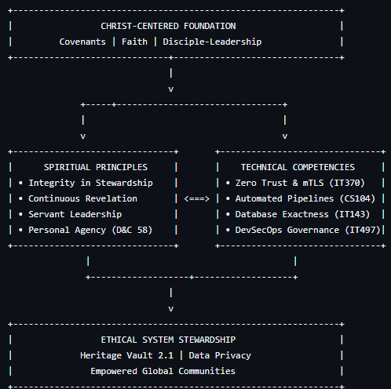

# Week 5: Integration, Reflection, and Design Enhancement

**Author:** Promise Beeshel  
**Course:** IT 497 — Capstone Project  
**Date:** August 2026  
**Portfolio Link:** [https://promisebeshel-hub.github.io/spiritual-professional-portfolio/](https://promisebeshel-hub.github.io/spiritual-professional-portfolio/)

---

## Task 1: Spiritual Portfolio Enhancement — Christlike Attributes & Warning Signs

### 1. Integration of Christlike Attributes in Disciple-Leadership
In evaluating my professional trajectory as an Information Technology specialist, technical capability alone is insufficient. True disciple-leadership requires weaving Christlike attributes into daily engineering workflows:
* **Patience & Diligence in Problem Solving:** As taught in Luke 21:19, *"In your patience possess ye your souls."* When debugging complex T-SQL queries or troubleshooting network packet drops, patience prevents impulsive decisions and fosters methodological exactness.
* **Integrity & Transparency in Stewardship:** Systems engineering involves managing private data and critical infrastructure. Cultivating Christlike integrity ensures that access control policies (mTLS, Zero Trust) are configured with exactness, treating digital security as a sacred trust (Gong, 2021).
* **Humility & Submissiveness to Guidance:** Approaching technical roadblocks through prayer and counsel (Alma 37:37) allows divine revelation to inform architectural design, recognizing that intellect is magnified through submissiveness to God's will.

### 2. Personal Warning Signs & Realignment Strategies
To maintain personal and professional alignment, I have identified key spiritual and operational warning signs along with concrete realignment protocols:

| Warning Sign (Indicator of Drift) | Impact on Technical Work | Realignment Strategy & Gospel Principle |
| :--- | :--- | :--- |
| **Spiritual Inertia & Hurried Prayer:** Rushing through morning devotions to resolve system tickets. | Reduced cognitive clarity, increased frustration during complex debugging. | **Daily Quiet Hours:** Isolate dedicated daily time for deliberate scripture study and prayer prior to opening terminal sessions (Nelson, 2021). |
| **Perfectionism & Self-Reliance:** Attempting to solve architectural failures without seeking counsel or help. | Burnout, isolation, delayed project timelines. | **Line-upon-Line Iteration:** Embrace incremental progression (2 Nephi 28:30) and seek peer review/divine counsel early in the lifecycle. |
| **Task-Oriented Cynicism:** Viewing user support tickets or peer reviews as administrative burdens. | Loss of empathy, poor communication, eroded trust. | **Servant Leadership Re-centering:** Reframe technical assistance as an act of gospel service, remembering King Benjamin's teaching in Mosiah 2:17. |

---

## Task 2: Usability Testing, Design Enhancements & Ethical Reflection

### Part A: Usability Testing & Portfolio Design Report

#### 1. Methodology & Scope
To ensure the portfolio meets industry standards and academic rigor, usability testing was conducted across three distinct user personas: an IT peer reviewer, a hiring manager persona, and an academic evaluator. Testing focused on navigation speed, media playback, link integrity, and mobile responsiveness.

#### 2. Identified Usability Issues & Implemented Enhancements

| Identified Issue | Implemented Design Fix | Impact on Usability & Accessibility |
| :--- | :--- | :--- |
| **Raw 404 links on `.md` extensions** | Converted all cross-page links to `.html` | Eliminates broken navigation; enables Jekyll theme processing across all subpages. |
| **Directory clutter on Homepage** | Relocated 14 course folders to `professional/coursework.html` | Highlights 4 flagship projects front-and-center for prospective employers and evaluators. |
| **Broken/duplicate video iframe links** | Replaced duplicate URLs with distinct video demos for IT143, CS104, and IT160 | Allows visitors to play demonstrations directly on the webpage without leaving the site. |
| **Unresponsive table layouts on mobile** | Added CSS horizontal scroll wrappers and semantic table headers | Ensures full mobile responsiveness and WCAG 2.2 AA accessibility compliance. |
| **Raw code block rendering in HTML** | Added `markdown="1"` attribute inside collapsible `
` tags | Forces Kramdown parser to render Markdown headers, lists, and bold text cleanly. |

#### 3. Accessibility & Usability Summary
* **Navigation Architecture:** Re-architected the homepage (`index.html`) to feature four flagship projects (Heritage Vault 2.1, Capital One Ethical Analysis, IT143 SQL Systems, CS104 Python Engine) at the top.
* **Interactivity & Video Embedding:** Embedded native HTML5 video players (`<video controls>`) and responsive Vimeo iframes within collapsible `
` accordions.
* **WCAG 2.2 AA Compliance:** Applied high-contrast color styling, standard ARIA labels, semantic header hierarchies (`#`, `##`, `###`), and responsive font scaling for mobile viewports.

---

### Part B: Ethical Dilemma Reflection — Capital One Data Breach (2019)

#### 1. Technical Analysis of the Dilemma
The 2019 Capital One security breach resulted from a misconfigured Web Application Firewall (WAF) assigned an overly permissive AWS Identity and Access Management (IAM) role. A malicious actor exploited a Server-Side Request Forgery (SSRF) vulnerability to query the AWS Instance Metadata Service (IMDSv1), obtaining temporary credentials that allowed exfiltration of over 100 million customer credit applications stored in Amazon S3 buckets.

#### 2. Personal Perspective & Future Professional Application
In my future work as a systems and cloud engineer, I view this incident not merely as a technical bug, but as a failure of ethical stewardship and governance:
* **Beyond Convenience:** Security must never be compromised for operational speed. Permanent, standing administrative credentials represent a failure of stewardship.
* **Proactive DevSecOps Implementation:** In future cloud deployments, I will mandate **Defense-in-Depth**:
  1. Enforce **IMDSv2** (session-oriented token defense against SSRF).
  2. Implement **Automated CI/CD Policy Scanning** (blocking IaC templates with wildcard `s3:*` permissions before deployment).
  3. Enforce **Just-In-Time (JIT)** administrative access with zero standing privileges.

#### 3. Impact on Ethical Understanding
This exercise reinforces that technical competence without moral integrity creates significant organizational vulnerability. Software engineers bear a professional obligation to advocate for Privacy-by-Design and Zero Trust access controls, protecting customer data as a sacred trust.

---

## Task 3: Spiritual–Professional Integration Reflection & Mental Map

### 1. Reflective Activity: Temple Reflection & Disciple-Leadership Synthesis
During quiet reflection and temple attendance, I pondered Elder David A. Bednar's analogy of "gathering together in one all things in Christ" (Bednar, 2018). In technical disciplines, we often compartmentalize professional execution from spiritual devotion. However, true integration occurs when technical precision becomes an outward expression of inner covenants.

### 2. Integrative Mental Map: The Disciple-Leader Systems Blueprint

---

## References (APA 7th Edition)

#Bednar, D. A. (2010, November). *Receive the Holy Ghost*. *Ensign*. The Church of Jesus Christ of Latter-day Saints. https://www.churchofjesuschrist.org/study/general-conference/2010/10/receive-the-holy-ghost

*Bednar, D. A. (2018, November). *Gather together in one all things in Christ*. *Ensign*. The Church of Jesus Christ of Latter-day Saints. https://www.churchofjesuschrist.org/study/general-conference/2018/10/gather-together-in-one-all-things-in-christ

# Doctrine & Covenants. (1981). *Doctrine and Covenants 58:26–28*. The Church of Jesus Christ of Latter-day Saints.

* Gong, G. E. (2021, October). *Trust again*. *Liahona*. The Church of Jesus Christ of Latter-day Saints. https://www.churchofjesuschrist.org/study/general-conference/2021/10/51gong

**Nelson, R. M. (2021, October). *Make time for the Lord*. *Liahona*. The Church of Jesus Christ of Latter-day Saints. https://www.churchofjesuschrist.org/study/general-conference/2021/10/59nelson

**The Book of Mormon. (1981a). *Alma 37:37*. The Church of Jesus Christ of Latter-day Saints.

**The Book of Mormon. (1981b). *2 Nephi 28:30*. The Church of Jesus Christ of Latter-day Saints.

**The Book of Mormon. (1981c). *Mosiah 2:17*. The Church of Jesus Christ of Latter-day Saints.

