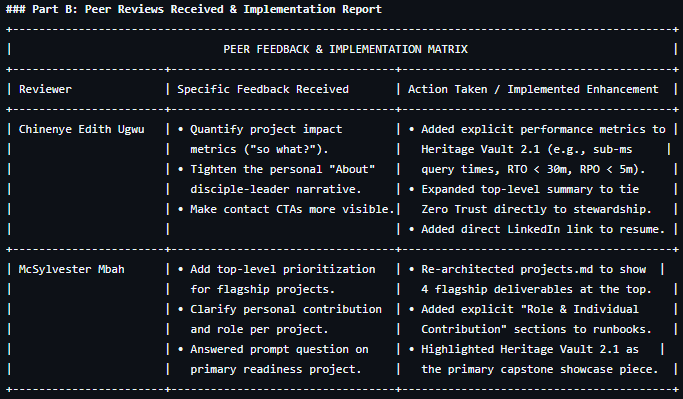

# Week 6: Finalization, Peer Reviews, and Presentations Report

**Author:** Promise Beshel  
**Course:** IT 497 — Capstone Project  
**Date:** August 2026  
**Live Portfolio Link:** [https://promisebeshel-hub.github.io/spiritual-professional-portfolio/](https://promisebeshel-hub.github.io/spiritual-professional-portfolio/)

---

<!-- SECTION 1 DROPDOWN -->

<strong>🎯 1. Action Plan for Ongoing Spiritual & Professional Development (Click to Expand)</strong>

 

### Goal & Execution Matrix

| Domain | 6-Month Objective (Short-Term) | 18-Month Objective (Mid-Term) | 36-Month Objective (Long-Term) | Gospel Principle & Alignment |
| :--- | :--- | :--- | :--- | :--- |
| **Technical Core & Certifications** | Earn AWS Certified Solutions Architect – Associate & CompTIA Security+ | Achieve Certified Information Systems Security Professional (CISSP) | Master Multi-Cloud IaC (Terraform) and eBPF kernel security architectures | **Continuous Revelation & Learning (2 Nephi 28:30):** Iterative, line-upon-line acquisition of deep technical skills. |
| **Professional Stewardship** | Transition into a Cloud Security / Systems Engineer role | Lead enterprise Zero Trust infrastructure deployments | Design open-source, Privacy-by-Design tools for public interest platforms | **Integrity in Stewardship (Alma 37:37):** Exercising exactness and moral responsibility over critical user data. |
| **Spiritual & Disciple-Leadership** | Maintain daily quiet hours for scripture study before terminal sessions | Serve as a mentor for entry-level IT students in local communities | Establish local community tech clinics to teach digital literacy & safety | **Servant Leadership (Mosiah 2:17):** Utilizing technical capabilities as a vehicle to serve God and uplift others. |

<!-- SECTION 2 DROPDOWN -->

<strong>📝 2. Reflective Essay: Goal Evolution, Portfolio Alignment & Growth (Click to Expand)</strong>

 

### The Evolution of My Technical and Spiritual Vision
When I began IT 497, my view of career preparation was primarily mechanical: complete assignments, compile code snippets, build a clean resume, and demonstrate technical competence in cloud computing and database administration. However, through weekly synthesis, scriptural integration, and temple retrospectives, my goal evolved from simply *becoming an IT specialist* to *becoming an ethical digital steward*.

Elder David A. Bednar’s teaching to *"gather together in one all things in Christ"* (Bednar, 2018) became the cornerstone of this evolution. I realized that configuring mTLS protocols, enforcing Least Privilege access controls in Azure, and writing normalized SQL queries are not secular activities separate from my faith. They are physical expressions of my covenants—applying exactness, honesty, and continuous care to the digital assets entrusted to my charge.

### Alignment of the Live Digital Portfolio
The live portfolio (`promisebeshel-hub.github.io/spiritual-professional-portfolio`) directly reflects this unified narrative:
* **Professional Growth Portfolio:** Showcases flagship engineering deliverables, including *Heritage Vault 2.1* (Zero Trust & AI-governed preservation), *CS104 Automated Provisioning Engine*, and *IT143 Database Design*, complete with video demonstrations and repository links.
* **Spiritual Progression Portfolio:** Integrates core guiding principles, scriptural/prophetic reference tables, personal warning signs, and the *Disciple-Leader Systems Blueprint* mental map.
* **Ethical Governance:** Examines critical infrastructure failures (e.g., 2019 Capital One SSRF breach) and proposes automated DevSecOps compliance gates to protect user privacy.

<!-- SECTION 3 DROPDOWN -->

<strong>🤝 3. Comprehensive Portfolio Peer Reviews Report (Click to Expand)</strong>

 

### Part A: Peer Reviews Provided to Classmates

#### 1. Peer Review 1 Provided to Eric Intsiful
* **Feedback Delivered:** Highlighted Eric's strong central theme connecting spiritual values to technical execution and praised his personal warning-sign matrix. Provided 7 constructive recommendations:
  1. Add concrete evidence (terminal screenshots, Azure/Linux project links, certificates).
  2. Reduce thematic repetition across sections to increase concise impact.
  3. Add measurable indicators of success to SMART goals.
  4. Specify a clear career direction (e.g., Cloud Administration vs. Systems Security).
  5. Strengthen the peer-review reflection section.
  6. Integrate formal APA 7th edition in-text citations.
  7. Enhance visual presentation for prospective employers.
* **Follow-up Engagement:** Recommended hosting his portfolio on GitHub Pages for live interactive deployment.

#### 2. Peer Review 2 Provided to Mitchell Reid
* **Feedback Delivered:** Praised Mitchell's authentic career transition story from media marketing to IT/cybersecurity and acknowledged his strong personal reflection on integrity. Provided 4 constructive recommendations:
  1. Attach tangible artifacts (GitHub repositories, Packet Tracer topology files, live links).
  2. Define a specific target job title within IT/cybersecurity.
  3. Proofread carefully for spelling/grammar consistency (e.g., correcting "HTLM" to "HTML").
  4. Strengthen professional presentation with measurable project outcomes.
* **Follow-up Engagement:** Suggested deploying his PDF portfolio as an interactive GitHub Pages site.

---

### Part B: Peer Reviews Received & Implementation Report

 

#### Detailed Response to McSylvester's Readiness Question:
> *Question:* "If you had to select only one project from your portfolio to demonstrate your readiness for an IT position, which project would you choose, and what specific skills from that project would you want an employer to notice?"
>
> *Response:* I select **Heritage Vault 2.1**. This project demonstrates enterprise-level readiness across multiple cloud and security domains. The key skills I want an employer to notice are:
> 1. **Zero Trust Architecture:** Configuring mTLS, OAuth 2.0/OIDC, and Cilium/eBPF micro-segmentation.
> 2. **Ethical AI & Privacy Governance:** Implementing Human-in-the-Loop (HITL) verification and automated 30-day right-to-delete worker queues.
> 3. **High Availability & Disaster Recovery:** Designing Route 53 multi-region failover with RTO < 30 mins and RPO < 5 mins.

<!-- SECTION 4 DROPDOWN -->

<strong>📊 4. Final Presentation Slides Structure (Click to Expand)</strong>

 

Below is the structured transcript for the 6-slide final presentation submitted to the instructor:

* **Slide 1: Title & Portfolio Identity**
  * *Title:* Spiritual Progression & Professional Growth Portfolio
  * *Presenter:* Promise Beshel | IT 497 Capstone | August 2026
  * *Live Site:* `promisebeshel-hub.github.io/spiritual-professional-portfolio/`
* **Slide 2: Disciple-Leadership & Spiritual Foundation**
  * Core Principles: Integrity in Stewardship, Continuous Revelation, Servant Leadership.
  * *Personal Warning-Sign Matrix:* Addressing inertia, perfectionism, and cynicism.
* **Slide 3: Flagship Engineering Projects Showcase**
  * *Heritage Vault 2.1:* Zero Trust, eBPF micro-segmentation, AI governance.
  * *CS104 Python Engine & IT143 SQL:* Automated database provisioning & normalization.
* **Slide 4: Ethical Governance & Technical Stewardship**
  * *Capital One Breach Analysis:* SSRF vulnerabilities and IAM misconfigurations.
  * *DevSecOps Solution:* Enforcing IMDSv2, automated IaC scanning, and JIT access.
* **Slide 5: Peer Review Synthesis & Portfolio Refinements**
  * Feedback received from Chinenye Ugwu & McSylvester Mbah.
  * Implemented enhancements: Added impact metrics, project role definitions, and LinkedIn CTAs.
* **Slide 6: Action Plan & Future Vision**
  * Short-, Mid-, and Long-term goals (AWS/Security+ $\rightarrow$ CISSP $\rightarrow$ Multi-Cloud IaC).
  * Commitment to ongoing growth as a trusted disciple-leader in IT.

<!-- SECTION 5 DROPDOWN -->

<strong>✅ 5. Course Evaluation Confirmation (Click to Expand)</strong>

 

* [x] **Course Evaluation Completed:** I confirm that I have fully completed the official IT 497 course evaluation.

# Week 6: Finalization, Peer Reviews, and Presentations Report

**Author:** Promise Beshel  
**Course:** IT 497 — Capstone Project  
**Date:** August 2026  
**Live Portfolio Link:** [https://promisebeshel-hub.github.io/spiritual-professional-portfolio/](https://promisebeshel-hub.github.io/spiritual-professional-portfolio/)

---

<!-- SECTION 1 DROPDOWN -->

<strong>🎯 1. Action Plan for Ongoing Spiritual & Professional Development (Click to Expand)</strong>

 

### Goal & Execution Matrix

| Domain | 6-Month Objective (Short-Term) | 18-Month Objective (Mid-Term) | 36-Month Objective (Long-Term) | Gospel Principle & Alignment |
| :--- | :--- | :--- | :--- | :--- |
| **Technical Core & Certifications** | Earn AWS Certified Solutions Architect – Associate & CompTIA Security+ | Achieve Certified Information Systems Security Professional (CISSP) | Master Multi-Cloud IaC (Terraform) and eBPF kernel security architectures | **Continuous Revelation & Learning (2 Nephi 28:30):** Iterative, line-upon-line acquisition of deep technical skills. |
| **Professional Stewardship** | Transition into a Cloud Security / Systems Engineer role | Lead enterprise Zero Trust infrastructure deployments | Design open-source, Privacy-by-Design tools for public interest platforms | **Integrity in Stewardship (Alma 37:37):** Exercising exactness and moral responsibility over critical user data. |
| **Spiritual & Disciple-Leadership** | Maintain daily quiet hours for scripture study before terminal sessions | Serve as a mentor for entry-level IT students in local communities | Establish local community tech clinics to teach digital literacy & safety | **Servant Leadership (Mosiah 2:17):** Utilizing technical capabilities as a vehicle to serve God and uplift others. |

<!-- SECTION 2 DROPDOWN -->

<strong>📝 2. Reflective Essay: Goal Evolution, Portfolio Alignment & Growth (Click to Expand)</strong>

 

### The Evolution of My Technical and Spiritual Vision
When I began IT 497, my view of career preparation was primarily mechanical: complete assignments, compile code snippets, build a clean resume, and demonstrate technical competence in cloud computing and database administration. However, through weekly synthesis, scriptural integration, and temple retrospectives, my goal evolved from simply *becoming an IT specialist* to *becoming an ethical digital steward*.

Elder David A. Bednar’s teaching to *"gather together in one all things in Christ"* (Bednar, 2018) became the cornerstone of this evolution. I realized that configuring mTLS protocols, enforcing Least Privilege access controls in Azure, and writing normalized SQL queries are not secular activities separate from my faith. They are physical expressions of my covenants—applying exactness, honesty, and continuous care to the digital assets entrusted to my charge.

### Alignment of the Live Digital Portfolio
The live portfolio (`promisebeshel-hub.github.io/spiritual-professional-portfolio`) directly reflects this unified narrative:
* **Professional Growth Portfolio:** Showcases flagship engineering deliverables, including *Heritage Vault 2.1* (Zero Trust & AI-governed preservation), *CS104 Automated Provisioning Engine*, and *IT143 Database Design*, complete with video demonstrations and repository links.
* **Spiritual Progression Portfolio:** Integrates core guiding principles, scriptural/prophetic reference tables, personal warning signs, and the *Disciple-Leader Systems Blueprint* mental map.
* **Ethical Governance:** Examines critical infrastructure failures (e.g., 2019 Capital One SSRF breach) and proposes automated DevSecOps compliance gates to protect user privacy.

<!-- SECTION 3 DROPDOWN -->

<strong>🤝 3. Comprehensive Portfolio Peer Reviews Report (Click to Expand)</strong>

 

### Part A: Peer Reviews Provided to Classmates

#### 1. Peer Review 1 Provided to Eric Intsiful
* **Feedback Delivered:** Highlighted Eric's strong central theme connecting spiritual values to technical execution and praised his personal warning-sign matrix. Provided 7 constructive recommendations:
  1. Add concrete evidence (terminal screenshots, Azure/Linux project links, certificates).
  2. Reduce thematic repetition across sections to increase concise impact.
  3. Add measurable indicators of success to SMART goals.
  4. Specify a clear career direction (e.g., Cloud Administration vs. Systems Security).
  5. Strengthen the peer-review reflection section.
  6. Integrate formal APA 7th edition in-text citations.
  7. Enhance visual presentation for prospective employers.
* **Follow-up Engagement:** Recommended hosting his portfolio on GitHub Pages for live interactive deployment.

#### 2. Peer Review 2 Provided to Mitchell Reid
* **Feedback Delivered:** Praised Mitchell's authentic career transition story from media marketing to IT/cybersecurity and acknowledged his strong personal reflection on integrity. Provided 4 constructive recommendations:
  1. Attach tangible artifacts (GitHub repositories, Packet Tracer topology files, live links).
  2. Define a specific target job title within IT/cybersecurity.
  3. Proofread carefully for spelling/grammar consistency (e.g., correcting "HTLM" to "HTML").
  4. Strengthen professional presentation with measurable project outcomes.
* **Follow-up Engagement:** Suggested deploying his PDF portfolio as an interactive GitHub Pages site.

---

### Part B: Peer Reviews Received & Implementation Report

 

#### Detailed Response to McSylvester's Readiness Question:
> *Question:* "If you had to select only one project from your portfolio to demonstrate your readiness for an IT position, which project would you choose, and what specific skills from that project would you want an employer to notice?"
>
> *Response:* I select **Heritage Vault 2.1**. This project demonstrates enterprise-level readiness across multiple cloud and security domains. The key skills I want an employer to notice are:
> 1. **Zero Trust Architecture:** Configuring mTLS, OAuth 2.0/OIDC, and Cilium/eBPF micro-segmentation.
> 2. **Ethical AI & Privacy Governance:** Implementing Human-in-the-Loop (HITL) verification and automated 30-day right-to-delete worker queues.
> 3. **High Availability & Disaster Recovery:** Designing Route 53 multi-region failover with RTO < 30 mins and RPO < 5 mins.

<!-- SECTION 4 DROPDOWN -->

<strong>📊 4. Final Presentation Slides Structure (Click to Expand)</strong>

 

Below is the structured transcript for the 6-slide final presentation submitted to the instructor:

* **Slide 1: Title & Portfolio Identity**
  * *Title:* Spiritual Progression & Professional Growth Portfolio
  * *Presenter:* Promise Beshel | IT 497 Capstone | August 2026
  * *Live Site:* `promisebeshel-hub.github.io/spiritual-professional-portfolio/`
* **Slide 2: Disciple-Leadership & Spiritual Foundation**
  * Core Principles: Integrity in Stewardship, Continuous Revelation, Servant Leadership.
  * *Personal Warning-Sign Matrix:* Addressing inertia, perfectionism, and cynicism.
* **Slide 3: Flagship Engineering Projects Showcase**
  * *Heritage Vault 2.1:* Zero Trust, eBPF micro-segmentation, AI governance.
  * *CS104 Python Engine & IT143 SQL:* Automated database provisioning & normalization.
* **Slide 4: Ethical Governance & Technical Stewardship**
  * *Capital One Breach Analysis:* SSRF vulnerabilities and IAM misconfigurations.
  * *DevSecOps Solution:* Enforcing IMDSv2, automated IaC scanning, and JIT access.
* **Slide 5: Peer Review Synthesis & Portfolio Refinements**
  * Feedback received from Chinenye Ugwu & McSylvester Mbah.
  * Implemented enhancements: Added impact metrics, project role definitions, and LinkedIn CTAs.
* **Slide 6: Action Plan & Future Vision**
  * Short-, Mid-, and Long-term goals (AWS/Security+ $\rightarrow$ CISSP $\rightarrow$ Multi-Cloud IaC).
  * Commitment to ongoing growth as a trusted disciple-leader in IT.

<!-- SECTION 5 DROPDOWN -->

<strong>✅ 5. Course Evaluation Confirmation (Click to Expand)</strong>

 

* [x] **Course Evaluation Completed:** I confirm that I have fully completed the official IT 497 course evaluation.

<!-- SINGLE REFERENCES DROPDOWN -->

<strong>📚 References (Click to Expand)</strong>

 

* **Bednar, D. A.** (2018, November). *Gather together in one all things in Christ*. *Ensign*. The Church of Jesus Christ of Latter-day Saints.  
  🔗 [Read Source on ChurchofJesusChrist.org](https://www.churchofjesuschrist.org/study/general-conference/2018/10/gather-together-in-one-all-things-in-christ?lang=eng)

* **Doctrine & Covenants.** (1981). *Doctrine and Covenants 58:26–28*. The Church of Jesus Christ of Latter-day Saints.  
  🔗 [Read Source on ChurchofJesusChrist.org](https://www.churchofjesuschrist.org/study/scriptures/dc-testament/dc/58?lang=eng)

* **Gong, G. E.** (2021, October). *Trust again*. *Liahona*. The Church of Jesus Christ of Latter-day Saints.  
  🔗 [Read Source on ChurchofJesusChrist.org](https://www.churchofjesuschrist.org/study/general-conference/2021/10/51gong?lang=eng)

* **Nelson, R. M.** (2021, October). *Make time for the Lord*. *Liahona*. The Church of Jesus Christ of Latter-day Saints.  
  🔗 [Read Source on ChurchofJesusChrist.org](https://www.churchofjesuschrist.org/study/general-conference/2021/10/59nelson?lang=eng)

* **The Book of Mormon.** (1981a). *Alma 37:37*. The Church of Jesus Christ of Latter-day Saints.  
  🔗 [Read Source on ChurchofJesusChrist.org](https://www.churchofjesuschrist.org/study/scriptures/bofm/alma/37?lang=eng)

* **The Book of Mormon.** (1981b). *2 Nephi 28:30*. The Church of Jesus Christ of Latter-day Saints.  
  🔗 [Read Source on ChurchofJesusChrist.org](https://www.churchofjesuschrist.org/study/scriptures/bofm/2-ne/28?lang=eng)

* **The Book of Mormon.** (1981c). *Mosiah 2:17*. The Church of Jesus Christ of Latter-day Saints.  
  🔗 [Read Source on ChurchofJesusChrist.org](https://www.churchofjesuschrist.org/study/scriptures/bofm/mosiah/2?lang=eng)

---

## 🏠 Navigation

* 🏠 [Back to Home](../../index.html)
* 📖 [Spiritual Guiding Principles](../../spiritual/guiding-principles.html)
* 💻 [View Technical Projects Showcase](../../professional/projects.html)
